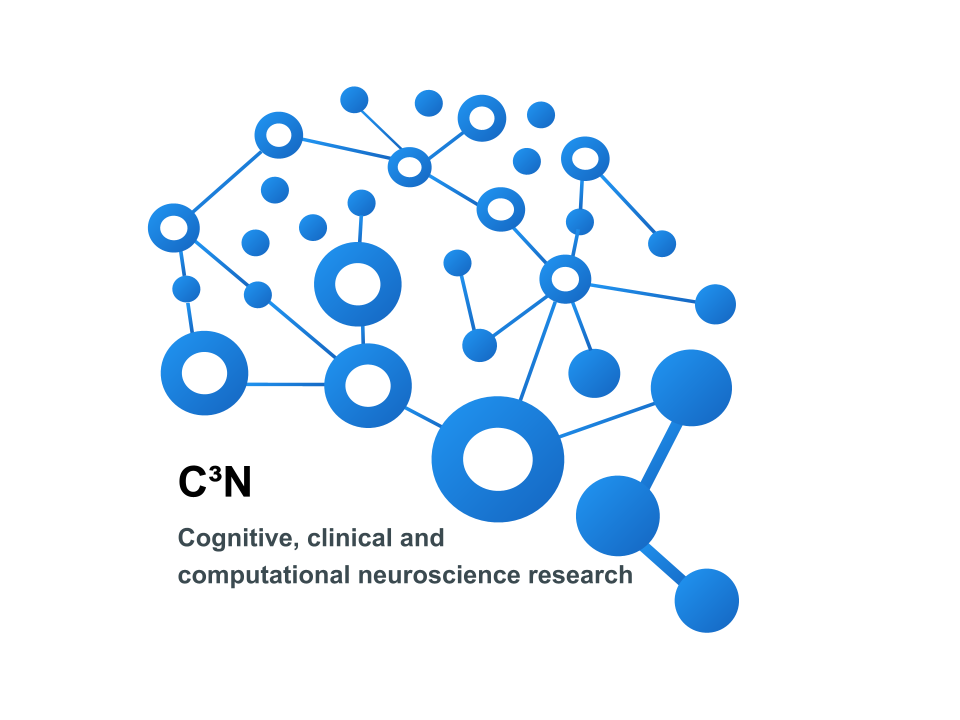
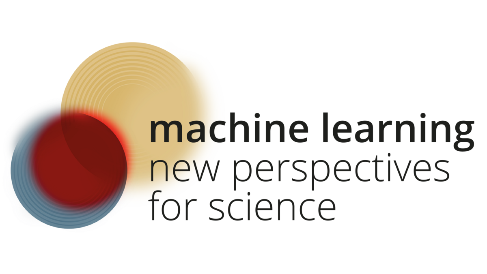
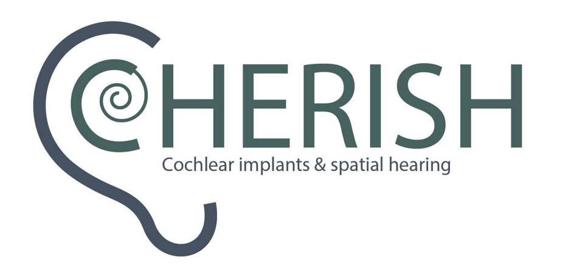
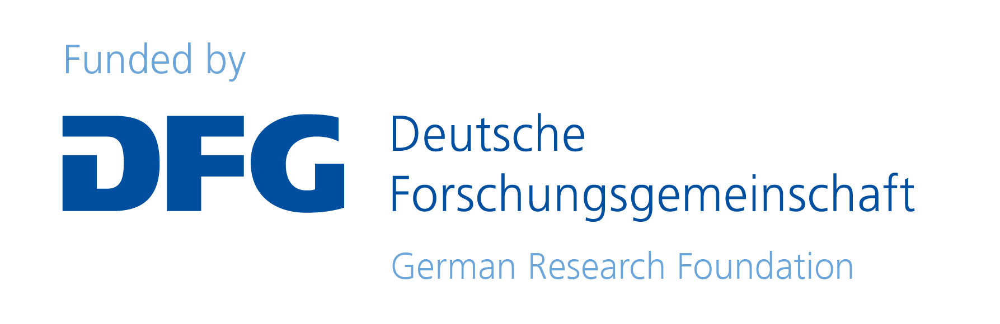
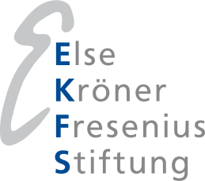

---
---

  📢 <strong>Check out our recent updates!</strong>
  <a href="/news" style="margin-left: 5px; padding: 4px 8px; background-color: #0d47a1; color: white; border-radius: 5px; text-decoration: none;">Go to News</a>

  

    <h3 style="font-size: 1.4em;">Dr. Stefanie Liebe - Cognitive, clinical and computational neuroscience research </h3>
    
My goal is to understand neural mechanisms underlying memory and high-level perception of the human brain. At the same time, I maintain a close relationship to clinical applications with the potential to provide transferrable insights for understanding neurological disorders with a specific focus on epilepsy.  I use machine-learning methods to analyse and interpret measurements of neural activity and behaviour.

  

  

    
  



## Highlights



Discover the researchers driving our advancements in cognitive and clinical neuroscience.









We invite you to explore our research, which spans a range of topics including investigating human brain activity at the single cell level, the application of artificial intelligence for clinical diagnostics in epilepsy and neural processes of spatial hearing.






<!--


Access a comprehensive list of our scholarly publications that reflect our ongoing contributions to neuroscience.







## Funding Agencies

  

    
  

  

    
  

  

    
  

  

    
  

  

    
  

  

    
  

